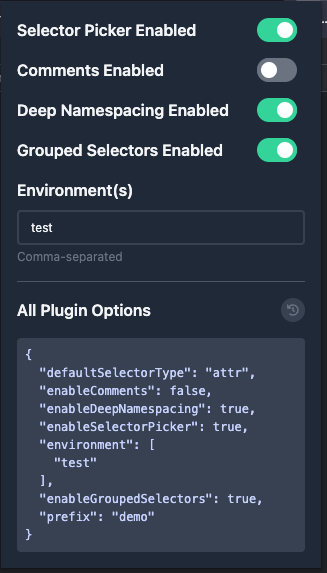

## Github PR Template Picker

**Install dependencies & build**

```bash
yarn && yarn build
```

**Install**

- In Chrome/Firefox/Brave, go to Manage Extensions
- Enable Developer Mode
- Load Unpacked from the `dist` directory

**Usage**

When browsing a Vue app using Vue Hubble v3.2.0 or greater, click the icon to change settings.


